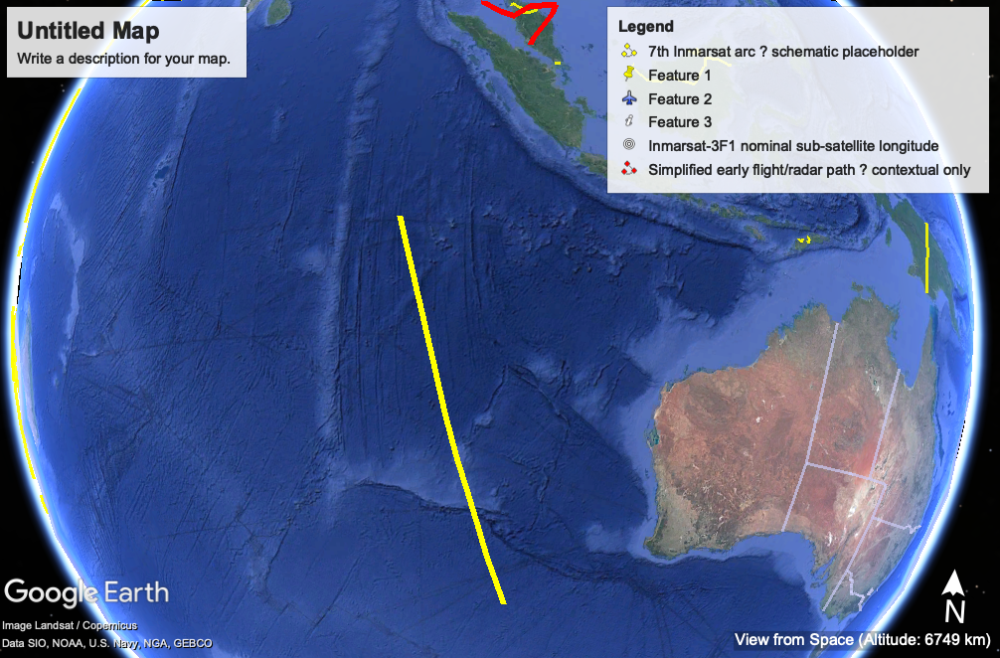

# MH370 Interactive Technical Atlas

## Purpose

This project is an evidence-first technical atlas and archive concerning the disappearance of Malaysia Airlines Flight MH370 on 8 March 2014.

The aim is to preserve, organise, map, and explain publicly available evidence in a structured, traceable, and non-sensational manner.

## Status and Scope

This is a continuing work in progress.

It is a lay research project, not an official investigation, legal finding, or claim to special knowledge.

The project is being built as an exercise in disciplined data gathering, source tracing, evidentiary weighting, and technical-methodological analysis. Its purpose is to organise and compare evidence streams, assumptions, uncertainties, and competing interpretations in a transparent way.

The atlas should be read as a structured research notebook and technical archive. It does not assert a final conclusion about the disappearance of MH370.

Where possible, claims are separated into levels of evidence strength, from primary official evidence through to contested or speculative material.

The project does not advocate a preferred conclusion. It is designed to keep official evidence, technical interpretation, assumptions, contested claims, and speculation clearly separated.

## Current Map Preview

This preview shows the current Google Earth visual layer associated with the atlas. At this early stage, the map is a work-in-progress visual aid and should not be read as a final reconstruction.

### Open the interactive Google Earth layer

For the easiest viewing option, download the packaged Google Earth file:

- [Download the current Google Earth KMZ map layer](https://raw.githubusercontent.com/Thwantac/MH370-Interactive-Technical-Atlas/main/maps/google-earth/mh370-core-waypoints.kmz)

To use it:

1. Click the KMZ link above.
2. If the file downloads, double-click it to open in Google Earth Pro.
3. If the browser opens a download prompt, save the `.kmz` file and then open it in Google Earth Pro.

The KMZ file is the easiest interactive Google Earth layer for general viewers.

The underlying source KML file is also available here for technical users:

- [Core waypoints KML source file](maps/google-earth/mh370-core-waypoints.kml)

## Core Principles

1. Primary sources are preferred.
2. All claims should be linked to a source.
3. Competing hypotheses may be documented, but the project does not advocate a conclusion without evidence.
4. Distinctions must be maintained between:
   - established facts
   - technical interpretations
   - assumptions
   - contested claims
   - speculative claims
5. Evidence strength and narrative interest are not the same thing.
6. Revision history should be preserved through Git.
7. Geographic outputs should separate official evidence, analysis, and hypotheses into clearly labelled map layers.

## Evidence Framework

The atlas uses a five-level evidence framework:

| Level | Label | Meaning |
|---|---|---|
| A | Primary official evidence | Official reports, primary records, recovered debris examinations, formally released records |
| B | Derived official or technical analysis | Official or contracted technical interpretation of primary evidence |
| C | Credible independent analysis | Serious independent work with transparent reasoning, assumptions, and traceable sources |
| D | Hypothesis-generating or contested evidence | Interesting but disputed or not yet validated claims, including experimental approaches |
| E | Speculative or unsupported claims | Claims without strong traceable evidence, preserved only when historically relevant |

Full discussion:

- [Project framework and evidence discussion](notes/project-framework-discussion.md)

## Dedication

- [Dedication](notes/dedication.md)

## Current Atlas Contents

### Structured data

- [Sources database](data/sources.csv)
- [Timeline database](data/timeline.csv)
- [Locations database](data/locations.csv)
- [Assumptions database](data/assumptions.csv)
- [Hypotheses database](data/hypotheses.csv)

### Notes

- [Proposed data sources](notes/proposed-data-sources.md)
- [Satellite systems introduction](notes/satellite-systems-introduction.txt)
- [Working notes](notes/working-notes.md)
- [How to resume](notes/how-to-resume.md)

### Google Earth outputs

- [Core waypoints KML](maps/google-earth/mh370-core-waypoints.kml)

## Project Structure

- `evidence/` — source documents and reference material
- `data/` — structured CSV datasets
- `maps/` — Google Earth files, map layers, and geographic outputs
- `notes/` — working notes, methodology, explanations, and commentary
- `scripts/` — code used to process or visualise data
- `site/` — future website or public-facing atlas
- `changelog.md` — record of project changes

## Mapping Philosophy

Google Earth and other map outputs should keep evidence categories separate.

Suggested future layer structure:

- Official timeline
- Civil ATC / secondary radar
- Military radar
- SATCOM / Inmarsat evidence
- Search areas
- Debris finds
- WSPR experimental analysis
- Other hypotheses
- Future declassified evidence
- Notes and cautions

Official evidence, contested evidence, and speculative hypotheses should not be visually merged without clear labelling.

## Retrospective Purpose

If MH370 is eventually found, the atlas should support a retrospective audit:

- Which predicted location was closest?
- Which evidence stream was most predictive?
- Which assumptions survived?
- Which assumptions failed?
- Which models overfit the available evidence?
- Which weak signals were genuinely useful?
- Which persuasive narratives were misleading?
- Which official choices were justified by evidence available at the time?
- Which non-official analysts were closest, and why?

The final goal is not only to document MH370, but to understand how technical truth emerges from incomplete, uncertain, and contested evidence.